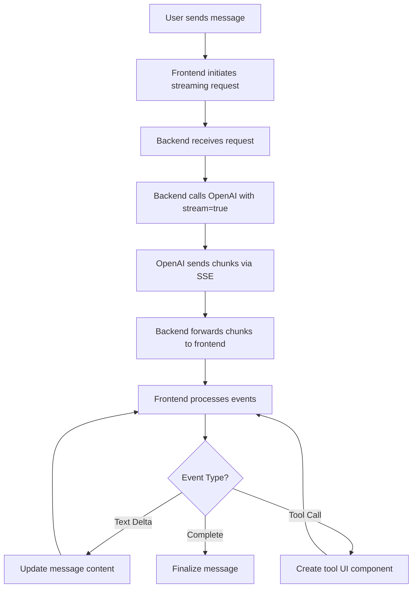

# Streaming Implementation Guide

## Overview

This guide covers the implementation of streaming responses for the OrganiChart AI chat interface, allowing users to see AI responses as they're generated in real-time.

## Architecture Overview



## Backend Implementation

### 1. Update Firebase Function for Streaming

**File: `functions/src/index.ts`**

```typescript
import { onRequest } from "firebase-functions/v2/https";
import OpenAI from "openai";

export const aiAgentStream = onRequest(
  {
    secrets: [openaiApiKey],
    // Important: Set timeout for streaming
    timeoutSeconds: 540, // 9 minutes
    cors: true,
  },
  async (req, res) => {
    const openai = new OpenAI({
      apiKey: openaiApiKey.value(),
    });

    // Set headers for Server-Sent Events
    res.set({
      "Content-Type": "text/event-stream",
      "Cache-Control": "no-cache",
      Connection: "keep-alive",
      "Access-Control-Allow-Origin": "*",
    });

    const { text, orgId, conversationContext } = req.body;

    try {
      // Create streaming completion
      const stream = await openai.chat.completions.create({
        model: "gpt-4o-mini",
        messages: [
          {
            role: "system",
            content: `You are OrganiChart Assistant. Current organization: ${orgId}`,
          },
          { role: "user", content: text },
        ],
        tools: functionDefs,
        stream: true, // Enable streaming
      });

      // Process stream
      for await (const chunk of stream) {
        const delta = chunk.choices[0]?.delta;

        if (delta) {
          // Send SSE event
          res.write(
            `data: ${JSON.stringify({
              type: "delta",
              content: delta,
            })}\n\n`
          );
        }

        // Handle tool calls
        if (delta?.tool_calls) {
          for (const toolCall of delta.tool_calls) {
            res.write(
              `data: ${JSON.stringify({
                type: "tool_call",
                toolCall: toolCall,
              })}\n\n`
            );
          }
        }
      }

      // Send completion event
      res.write(`data: ${JSON.stringify({ type: "done" })}\n\n`);
      res.end();
    } catch (error) {
      res.write(
        `data: ${JSON.stringify({
          type: "error",
          error: error.message,
        })}\n\n`
      );
      res.end();
    }
  }
);
```

### 2. Handle Tool Execution During Streaming

```typescript
// Helper function to execute tools and stream results
async function executeToolAndStream(toolCall: any, res: any, orgId: string) {
  res.write(
    `data: ${JSON.stringify({
      type: "tool_execution_start",
      toolId: toolCall.id,
      toolName: toolCall.function.name,
    })}\n\n`
  );

  try {
    const args = JSON.parse(toolCall.function.arguments);
    let result;

    switch (toolCall.function.name) {
      case "getUserInformation":
        result = await getUserInformation({ ...args, organizationId: orgId });
        break;
      case "addUser":
        result = await addUser({ ...args, organizationId: orgId });
        break;
      // ... other tools
    }

    res.write(
      `data: ${JSON.stringify({
        type: "tool_execution_complete",
        toolId: toolCall.id,
        result: result,
      })}\n\n`
    );
  } catch (error) {
    res.write(
      `data: ${JSON.stringify({
        type: "tool_execution_error",
        toolId: toolCall.id,
        error: error.message,
      })}\n\n`
    );
  }
}
```

## Frontend Implementation

### 1. Update Chat Store for Streaming

**File: `src/lib/stores/chat.ts`**

```typescript
import { writable, get } from "svelte/store";

export interface StreamEvent {
  type:
    | "delta"
    | "tool_call"
    | "tool_execution_start"
    | "tool_execution_complete"
    | "tool_execution_error"
    | "done"
    | "error";
  content?: any;
  toolCall?: any;
  toolId?: string;
  toolName?: string;
  result?: any;
  error?: string;
}

export interface ChatMessage {
  id: string;
  role: "user" | "assistant";
  content: string;
  timestamp: Date;
  isStreaming?: boolean;
  toolCalls?: ToolCall[];
}

export interface ToolCall {
  id: string;
  name: string;
  arguments: any;
  status: "pending" | "executing" | "complete" | "error";
  result?: any;
  error?: string;
}

// New function for streaming messages
export async function sendStreamingMessage(
  text: string,
  options: { useAgent?: boolean; orgId?: string | null } = {}
) {
  const messageId = crypto.randomUUID();

  // Add user message
  appendMessage("user", text);

  // Add placeholder assistant message
  const assistantMessage: ChatMessage = {
    id: messageId,
    role: "assistant",
    content: "",
    timestamp: new Date(),
    isStreaming: true,
    toolCalls: [],
  };

  chatHistory.update((h) => [...h, assistantMessage]);
  isThinking.set(true);
  chatError.set(null);

  const resolvedOrgId =
    options.orgId !== undefined ? options.orgId : get(orgIdContext);

  try {
    const response = await fetch(`${AI_AGENT_URL}/stream`, {
      method: "POST",
      headers: {
        "Content-Type": "application/json",
        Accept: "text/event-stream",
      },
      body: JSON.stringify({
        text,
        orgId: resolvedOrgId,
        conversationContext: getRecentContext(),
      }),
    });

    if (!response.ok) {
      throw new Error(`HTTP ${response.status}: ${response.statusText}`);
    }

    // Process stream
    const reader = response.body?.getReader();
    const decoder = new TextDecoder();

    if (!reader) throw new Error("No response body");

    while (true) {
      const { done, value } = await reader.read();
      if (done) break;

      const chunk = decoder.decode(value);
      const events = parseSSEEvents(chunk);

      for (const event of events) {
        await processStreamEvent(event, messageId);
      }
    }
  } catch (error) {
    console.error("Streaming error:", error);
    updateMessageById(messageId, {
      content: `Error: ${error.message}`,
      isStreaming: false,
    });
    chatError.set(error.message);
  } finally {
    updateMessageById(messageId, { isStreaming: false });
    isThinking.set(false);
  }
}

// Parse Server-Sent Events
function parseSSEEvents(chunk: string): StreamEvent[] {
  const events: StreamEvent[] = [];
  const lines = chunk.split("\n");

  for (const line of lines) {
    if (line.startsWith("data: ")) {
      try {
        const data = JSON.parse(line.slice(6));
        events.push(data);
      } catch (e) {
        console.error("Failed to parse SSE event:", e);
      }
    }
  }

  return events;
}

// Process individual stream events
async function processStreamEvent(event: StreamEvent, messageId: string) {
  switch (event.type) {
    case "delta":
      // Append text delta to message
      if (event.content?.content) {
        chatHistory.update((messages) =>
          messages.map((msg) =>
            msg.id === messageId
              ? { ...msg, content: msg.content + event.content.content }
              : msg
          )
        );
      }
      break;

    case "tool_call":
      // Add new tool call
      const toolCall: ToolCall = {
        id: event.toolCall.id,
        name: event.toolCall.function.name,
        arguments: JSON.parse(event.toolCall.function.arguments),
        status: "pending",
      };

      chatHistory.update((messages) =>
        messages.map((msg) =>
          msg.id === messageId
            ? { ...msg, toolCalls: [...(msg.toolCalls || []), toolCall] }
            : msg
        )
      );
      break;

    case "tool_execution_start":
      // Update tool status to executing
      updateToolCallStatus(messageId, event.toolId!, "executing");
      break;

    case "tool_execution_complete":
      // Update tool with result
      updateToolCallResult(messageId, event.toolId!, event.result, "complete");
      break;

    case "tool_execution_error":
      // Update tool with error
      updateToolCallResult(
        messageId,
        event.toolId!,
        null,
        "error",
        event.error
      );
      break;

    case "done":
      // Message complete
      updateMessageById(messageId, { isStreaming: false });
      break;

    case "error":
      // Handle error
      throw new Error(event.error || "Unknown streaming error");
  }
}

// Helper functions
function updateMessageById(messageId: string, updates: Partial<ChatMessage>) {
  chatHistory.update((messages) =>
    messages.map((msg) => (msg.id === messageId ? { ...msg, ...updates } : msg))
  );
}

function updateToolCallStatus(
  messageId: string,
  toolId: string,
  status: ToolCall["status"]
) {
  chatHistory.update((messages) =>
    messages.map((msg) => {
      if (msg.id === messageId && msg.toolCalls) {
        return {
          ...msg,
          toolCalls: msg.toolCalls.map((tc) =>
            tc.id === toolId ? { ...tc, status } : tc
          ),
        };
      }
      return msg;
    })
  );
}

function updateToolCallResult(
  messageId: string,
  toolId: string,
  result: any,
  status: ToolCall["status"],
  error?: string
) {
  chatHistory.update((messages) =>
    messages.map((msg) => {
      if (msg.id === messageId && msg.toolCalls) {
        return {
          ...msg,
          toolCalls: msg.toolCalls.map((tc) =>
            tc.id === toolId ? { ...tc, status, result, error } : tc
          ),
        };
      }
      return msg;
    })
  );
}
```

### 2. Update Chat Panel Component

**File: `src/lib/components/ChatPanel.svelte`**

```svelte
<script>
  import { chatHistory, sendStreamingMessage, isThinking } from '$lib/stores/chat.js';
  import ToolCallDisplay from './chat/ToolCallDisplay.svelte';

  let input = '';

  async function handleSend() {
    if (!input.trim() || $isThinking) return;

    const message = input;
    input = ''; // Clear immediately

    // Use streaming message function
    await sendStreamingMessage(message);
  }
</script>

<div class="chat-messages">
  {#each $chatHistory as message}
    <div class="message {message.role}">
      {#if message.role === 'assistant'}
        <!-- Render markdown content -->
        <div class="message-content">
          {@html renderMarkdown(message.content)}
          {#if message.isStreaming}
            <span class="cursor-blink">▊</span>
          {/if}
        </div>

        <!-- Render tool calls -->
        {#if message.toolCalls && message.toolCalls.length > 0}
          <div class="tool-calls">
            {#each message.toolCalls as toolCall}
              <ToolCallDisplay {toolCall} />
            {/each}
          </div>
        {/if}
      {:else}
        <div class="message-content">{message.content}</div>
      {/if}
    </div>
  {/each}
</div>

<style>
  .cursor-blink {
    animation: blink 1s infinite;
    color: var(--primary-color);
    font-weight: bold;
  }

  @keyframes blink {
    0%, 50% { opacity: 1; }
    51%, 100% { opacity: 0; }
  }

  .tool-calls {
    margin-top: 8px;
    display: flex;
    flex-direction: column;
    gap: 8px;
  }
</style>
```

## Deployment Considerations

### 1. Firebase Functions Configuration

Update `firebase.json`:

```json
{
  "functions": {
    "runtime": "nodejs18",
    "source": "functions",
    "predeploy": ["npm --prefix \"$RESOURCE_DIR\" run build"],
    "timeout": "540s",
    "memory": "1GB"
  }
}
```

### 2. CORS Configuration

Ensure proper CORS headers for streaming:

```typescript
const corsOptions = {
  origin: true,
  credentials: true,
  methods: ["GET", "POST", "OPTIONS"],
  allowedHeaders: ["Content-Type", "Accept"],
  exposedHeaders: ["Content-Type"],
};
```

### 3. Error Handling

Implement reconnection logic for dropped connections:

```typescript
async function streamWithRetry(text: string, maxRetries = 3) {
  let retries = 0;

  while (retries < maxRetries) {
    try {
      await sendStreamingMessage(text);
      break;
    } catch (error) {
      retries++;
      if (retries >= maxRetries) throw error;

      // Exponential backoff
      await new Promise((resolve) =>
        setTimeout(resolve, Math.pow(2, retries) * 1000)
      );
    }
  }
}
```

## Testing

### 1. Test Streaming Response

```typescript
// Test basic streaming
await sendStreamingMessage("Tell me a story about a robot");

// Test with tool calls
await sendStreamingMessage("Add John Doe as a developer under Jane Smith");
```

### 2. Performance Monitoring

- Monitor Firebase Functions execution time
- Track streaming latency
- Measure time to first byte (TTFB)
- Monitor connection drops and retries

## Best Practices

1. **Buffer Management**: Implement proper buffering for smooth text display
2. **Connection Management**: Handle connection drops gracefully
3. **Memory Management**: Clean up event listeners and streams
4. **Error Boundaries**: Implement error boundaries for streaming failures
5. **Fallback**: Provide non-streaming fallback for older browsers

## Troubleshooting

### Common Issues

1. **Connection Drops**

   - Implement automatic reconnection
   - Save partial responses
   - Resume from last known position

2. **Slow Streaming**

   - Check Firebase Function cold starts
   - Optimize function initialization
   - Consider keeping functions warm

3. **Character Encoding**

   - Use TextDecoder with proper encoding
   - Handle multi-byte characters correctly

4. **Memory Leaks**
   - Clean up event listeners
   - Close streams properly
   - Clear references to old messages
