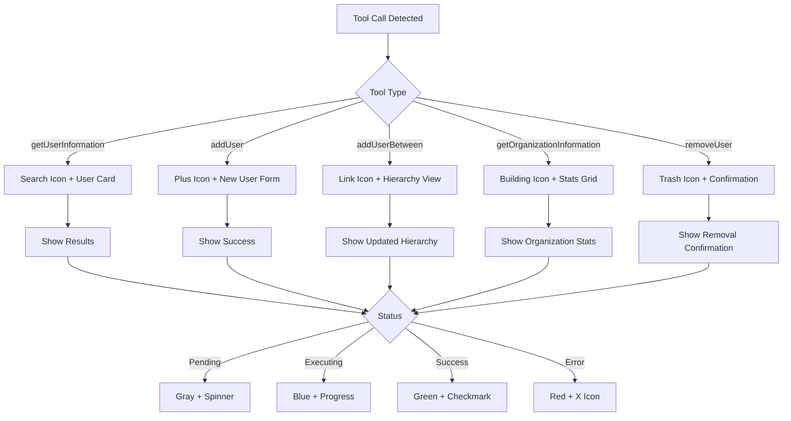

# Tool UI Implementation Guide

## Overview

This guide covers the implementation of specialized UI components for displaying tool calls in the OrganiChart AI chat interface. Each tool will have its own visual representation with real-time status updates.

## Tool Call Flow



## Component Structure

### 1. Base Tool Call Component

**File: `src/lib/components/chat/ToolCallCard.svelte`**

```svelte
<script lang="ts">
  import { createEventDispatcher } from 'svelte';
  import type { ToolCall } from '$lib/stores/chat';

  export let toolCall: ToolCall;

  const dispatch = createEventDispatcher();

  // Map tool names to icons
  const toolIcons = {
    getUserInformation: 'search',
    addUser: 'user-plus',
    addUserBetween: 'link',
    getOrganizationInformation: 'building',
    removeUser: 'trash'
  };

  // Map tool names to friendly titles
  const toolTitles = {
    getUserInformation: 'Searching for User',
    addUser: 'Adding New Member',
    addUserBetween: 'Inserting Member in Hierarchy',
    getOrganizationInformation: 'Fetching Organization Info',
    removeUser: 'Removing Member'
  };

  $: icon = toolIcons[toolCall.name] || 'tool';
  $: title = toolTitles[toolCall.name] || toolCall.name;
  $: isExpanded = toolCall.status !== 'pending';
</script>

<div class="tool-card {toolCall.status}" class:expanded={isExpanded}>
  <div class="tool-header" on:click={() => isExpanded = !isExpanded}>
    <div class="tool-info">
      <i class="icon icon-{icon}"></i>
      <span class="tool-title">{title}</span>
    </div>

    <div class="tool-status">
      {#if toolCall.status === 'pending'}
        <span class="status-text">Waiting...</span>
      {:else if toolCall.status === 'executing'}
        <div class="spinner"></div>
        <span class="status-text">Running...</span>
      {:else if toolCall.status === 'complete'}
        <i class="icon icon-check"></i>
        <span class="status-text">Complete</span>
      {:else if toolCall.status === 'error'}
        <i class="icon icon-x"></i>
        <span class="status-text">Failed</span>
      {/if}
    </div>
  </div>

  {#if isExpanded}
    <div class="tool-content">
      <slot {toolCall}>
        <!-- Default content if no specific component -->
        <div class="tool-details">
          <pre>{JSON.stringify(toolCall.arguments, null, 2)}</pre>
          {#if toolCall.result}
            <div class="tool-result">
              <h4>Result:</h4>
              <pre>{JSON.stringify(toolCall.result, null, 2)}</pre>
            </div>
          {/if}
          {#if toolCall.error}
            <div class="tool-error">
              <h4>Error:</h4>
              <p>{toolCall.error}</p>
            </div>
          {/if}
        </div>
      </slot>
    </div>
  {/if}
</div>

<style>
  .tool-card {
    border: 1px solid var(--border-color);
    border-radius: 8px;
    overflow: hidden;
    transition: all 0.3s ease;
    margin: 4px 0;
  }

  .tool-card.pending {
    opacity: 0.6;
    border-color: #gray;
  }

  .tool-card.executing {
    border-color: #3b82f6;
    box-shadow: 0 0 0 1px rgba(59, 130, 246, 0.2);
  }

  .tool-card.complete {
    border-color: #10b981;
  }

  .tool-card.error {
    border-color: #ef4444;
    background-color: rgba(239, 68, 68, 0.05);
  }

  .tool-header {
    display: flex;
    justify-content: space-between;
    align-items: center;
    padding: 12px 16px;
    cursor: pointer;
    background-color: rgba(0, 0, 0, 0.02);
  }

  .tool-info {
    display: flex;
    align-items: center;
    gap: 8px;
  }

  .icon {
    width: 20px;
    height: 20px;
  }

  .tool-status {
    display: flex;
    align-items: center;
    gap: 6px;
    font-size: 0.875rem;
  }

  .spinner {
    width: 16px;
    height: 16px;
    border: 2px solid #f3f4f6;
    border-top-color: #3b82f6;
    border-radius: 50%;
    animation: spin 0.8s linear infinite;
  }

  @keyframes spin {
    to { transform: rotate(360deg); }
  }

  .tool-content {
    padding: 16px;
    border-top: 1px solid var(--border-color);
  }

  .tool-details pre {
    background-color: #f9fafb;
    padding: 8px;
    border-radius: 4px;
    font-size: 0.875rem;
    overflow-x: auto;
  }
</style>
```

### 2. Tool Call Display Router

**File: `src/lib/components/chat/ToolCallDisplay.svelte`**

```svelte
<script lang="ts">
  import type { ToolCall } from '$lib/stores/chat';
  import ToolCallCard from './ToolCallCard.svelte';

  // Import specific tool components
  import GetUserInfoTool from './tools/GetUserInfoTool.svelte';
  import AddUserTool from './tools/AddUserTool.svelte';
  import AddUserBetweenTool from './tools/AddUserBetweenTool.svelte';
  import GetOrgInfoTool from './tools/GetOrgInfoTool.svelte';
  import RemoveUserTool from './tools/RemoveUserTool.svelte';

  export let toolCall: ToolCall;

  // Map tool names to components
  const toolComponents = {
    getUserInformation: GetUserInfoTool,
    addUser: AddUserTool,
    addUserBetween: AddUserBetweenTool,
    getOrganizationInformation: GetOrgInfoTool,
    removeUser: RemoveUserTool
  };

  $: ToolComponent = toolComponents[toolCall.name];
</script>

<ToolCallCard {toolCall}>
  {#if ToolComponent}
    <svelte:component this={ToolComponent} {toolCall} />
  {/if}
</ToolCallCard>
```

### 3. Specific Tool Components

#### Get User Information Tool

**File: `src/lib/components/chat/tools/GetUserInfoTool.svelte`**

```svelte
<script lang="ts">
  import type { ToolCall } from '$lib/stores/chat';

  export let toolCall: ToolCall;

  $: searchQuery = toolCall.arguments?.userName || '';
  $: result = toolCall.result;
  $: hasExactMatches = result?.exactMatches?.length > 0;
  $: hasSuggestions = result?.suggestions?.length > 0;
</script>

<div class="search-tool">
  <div class="search-query">
    <i class="icon icon-search"></i>
    <span>Searching for: <strong>{searchQuery}</strong></span>
  </div>

  {#if toolCall.status === 'complete' && result}
    {#if hasExactMatches}
      <div class="matches-section">
        <h4>Found {result.exactMatches.length} match{result.exactMatches.length > 1 ? 'es' : ''}:</h4>
        <div class="user-list">
          {#each result.exactMatches as match}
            <div class="user-card">
              <div class="user-avatar">
                {match.name.charAt(0).toUpperCase()}
              </div>
              <div class="user-info">
                <div class="user-name">{match.name}</div>
                <div class="user-role">{match.role}</div>
                <div class="user-email">{match.email}</div>
              </div>
              <div class="match-confidence">
                <span class="confidence-badge {match.confidence === 100 ? 'perfect' : 'good'}">
                  {match.confidence}% match
                </span>
              </div>
            </div>
          {/each}
        </div>
      </div>
    {:else if hasSuggestions}
      <div class="suggestions-section">
        <h4>No exact matches. Did you mean:</h4>
        <div class="suggestion-list">
          {#each result.suggestions as suggestion}
            <div class="suggestion-item">
              <span class="suggestion-name">{suggestion.name}</span>
              <span class="suggestion-confidence">({suggestion.confidence}% similar)</span>
            </div>
          {/each}
        </div>
      </div>
    {:else}
      <div class="no-results">
        <i class="icon icon-user-x"></i>
        <p>No users found matching "{searchQuery}"</p>
      </div>
    {/if}
  {:else if toolCall.status === 'error'}
    <div class="error-message">
      <i class="icon icon-alert-circle"></i>
      <p>{toolCall.error || 'Failed to search for user'}</p>
    </div>
  {/if}
</div>

<style>
  .search-tool {
    display: flex;
    flex-direction: column;
    gap: 16px;
  }

  .search-query {
    display: flex;
    align-items: center;
    gap: 8px;
    color: #6b7280;
  }

  .user-card {
    display: flex;
    align-items: center;
    gap: 12px;
    padding: 12px;
    background: #f9fafb;
    border-radius: 8px;
    border: 1px solid #e5e7eb;
  }

  .user-avatar {
    width: 40px;
    height: 40px;
    border-radius: 50%;
    background: #3b82f6;
    color: white;
    display: flex;
    align-items: center;
    justify-content: center;
    font-weight: 600;
  }

  .user-info {
    flex: 1;
  }

  .user-name {
    font-weight: 600;
    color: #111827;
  }

  .user-role {
    font-size: 0.875rem;
    color: #6b7280;
  }

  .user-email {
    font-size: 0.75rem;
    color: #9ca3af;
  }

  .confidence-badge {
    padding: 4px 8px;
    border-radius: 4px;
    font-size: 0.75rem;
    font-weight: 500;
  }

  .confidence-badge.perfect {
    background: #d1fae5;
    color: #065f46;
  }

  .confidence-badge.good {
    background: #dbeafe;
    color: #1e40af;
  }

  .no-results {
    text-align: center;
    padding: 24px;
    color: #6b7280;
  }

  .error-message {
    display: flex;
    align-items: center;
    gap: 8px;
    color: #dc2626;
    padding: 12px;
    background: #fee2e2;
    border-radius: 6px;
  }
</style>
```

#### Add User Tool

**File: `src/lib/components/chat/tools/AddUserTool.svelte`**

```svelte
<script lang="ts">
  import type { ToolCall } from '$lib/stores/chat';

  export let toolCall: ToolCall;

  $: args = toolCall.arguments;
  $: result = toolCall.result;
</script>

<div class="add-user-tool">
  <div class="user-preview">
    <h4>Adding new member:</h4>
    <div class="user-details">
      <div class="detail-row">
        <span class="label">Name:</span>
        <span class="value">{args.name}</span>
      </div>
      <div class="detail-row">
        <span class="label">Role:</span>
        <span class="value">{args.role}</span>
      </div>
      {#if args.email}
        <div class="detail-row">
          <span class="label">Email:</span>
          <span class="value">{args.email}</span>
        </div>
      {/if}
      {#if args.managerId}
        <div class="detail-row">
          <span class="label">Reports to:</span>
          <span class="value">Manager ID: {args.managerId}</span>
        </div>
      {/if}
    </div>
  </div>

  {#if toolCall.status === 'complete' && result}
    <div class="success-message">
      <i class="icon icon-check-circle"></i>
      <p>Successfully added {result.name} to the organization!</p>
      <span class="member-id">Member ID: {result.id}</span>
    </div>
  {:else if toolCall.status === 'error'}
    <div class="error-message">
      <i class="icon icon-x-circle"></i>
      <p>{toolCall.error || 'Failed to add user'}</p>
    </div>
  {/if}
</div>

<style>
  .add-user-tool {
    display: flex;
    flex-direction: column;
    gap: 16px;
  }

  .user-details {
    background: #f9fafb;
    padding: 12px;
    border-radius: 6px;
    display: flex;
    flex-direction: column;
    gap: 8px;
  }

  .detail-row {
    display: flex;
    gap: 8px;
  }

  .label {
    font-weight: 500;
    color: #6b7280;
    min-width: 80px;
  }

  .value {
    color: #111827;
  }

  .success-message {
    background: #d1fae5;
    color: #065f46;
    padding: 12px;
    border-radius: 6px;
    display: flex;
    flex-direction: column;
    gap: 4px;
  }

  .member-id {
    font-size: 0.75rem;
    font-family: monospace;
    opacity: 0.8;
  }
</style>
```

#### Organization Info Tool

**File: `src/lib/components/chat/tools/GetOrgInfoTool.svelte`**

```svelte
<script lang="ts">
  import type { ToolCall } from '$lib/stores/chat';

  export let toolCall: ToolCall;

  $: args = toolCall.arguments;
  $: result = toolCall.result;
  $: stats = result?.statistics;
</script>

<div class="org-info-tool">
  {#if args.query}
    <div class="search-params">
      <i class="icon icon-filter"></i>
      <span>Filter: <strong>{args.query}</strong></span>
      {#if args.filterBy && args.filterBy !== 'all'}
        <span class="filter-type">by {args.filterBy}</span>
      {/if}
    </div>
  {/if}

  {#if toolCall.status === 'complete' && result}
    <div class="org-stats">
      <div class="stat-card">
        <div class="stat-value">{stats.totalMembers}</div>
        <div class="stat-label">Total Members</div>
      </div>
      <div class="stat-card">
        <div class="stat-value">{stats.topLevelMembers}</div>
        <div class="stat-label">Top Level</div>
      </div>
      <div class="stat-card">
        <div class="stat-value">{stats.managersCount}</div>
        <div class="stat-label">Managers</div>
      </div>
    </div>

    {#if result.members.length > 0}
      <div class="members-preview">
        <h4>Members ({result.members.length}):</h4>
        <div class="member-grid">
          {#each result.members.slice(0, 5) as member}
            <div class="member-item">
              <div class="member-name">{member.name}</div>
              <div class="member-role">{member.role}</div>
              {#if member.hasSubordinates}
                <span class="has-reports">Has reports</span>
              {/if}
            </div>
          {/each}
          {#if result.members.length > 5}
            <div class="more-members">
              +{result.members.length - 5} more...
            </div>
          {/if}
        </div>
      </div>
    {/if}

    {#if Object.keys(stats.roleBreakdown || {}).length > 0}
      <div class="role-breakdown">
        <h4>Role Distribution:</h4>
        <div class="role-list">
          {#each Object.entries(stats.roleBreakdown) as [role, count]}
            <div class="role-item">
              <span class="role-name">{role}</span>
              <span class="role-count">{count}</span>
            </div>
          {/each}
        </div>
      </div>
    {/if}
  {:else if toolCall.status === 'error'}
    <div class="error-message">
      <i class="icon icon-alert-triangle"></i>
      <p>{toolCall.error || 'Failed to fetch organization info'}</p>
    </div>
  {/if}
</div>

<style>
  .org-info-tool {
    display: flex;
    flex-direction: column;
    gap: 16px;
  }

  .org-stats {
    display: grid;
    grid-template-columns: repeat(3, 1fr);
    gap: 12px;
  }

  .stat-card {
    background: #f3f4f6;
    padding: 16px;
    border-radius: 8px;
    text-align: center;
  }

  .stat-value {
    font-size: 1.5rem;
    font-weight: 700;
    color: #111827;
  }

  .stat-label {
    font-size: 0.875rem;
    color: #6b7280;
    margin-top: 4px;
  }

  .member-grid {
    display: grid;
    gap: 8px;
  }

  .member-item {
    display: flex;
    align-items: center;
    gap: 8px;
    padding: 8px;
    background: #f9fafb;
    border-radius: 6px;
    font-size: 0.875rem;
  }

  .member-name {
    font-weight: 500;
    color: #111827;
  }

  .member-role {
    color: #6b7280;
    flex: 1;
  }

  .has-reports {
    background: #dbeafe;
    color: #1e40af;
    padding: 2px 6px;
    border-radius: 4px;
    font-size: 0.75rem;
  }

  .role-breakdown {
    background: #f9fafb;
    padding: 12px;
    border-radius: 8px;
  }

  .role-list {
    display: flex;
    flex-direction: column;
    gap: 6px;
    margin-top: 8px;
  }

  .role-item {
    display: flex;
    justify-content: space-between;
    align-items: center;
    padding: 4px 0;
  }

  .role-count {
    background: #e5e7eb;
    padding: 2px 8px;
    border-radius: 12px;
    font-size: 0.875rem;
    font-weight: 500;
  }
</style>
```

## Integration with Streaming

### Handling Tool Call Events

When streaming is enabled, tool calls arrive as events that need to be processed:

```typescript
// In processStreamEvent function
case 'response.output_item.added':
  if (event.item.type === 'function_call') {
    const toolCall: ToolCall = {
      id: event.item.id,
      name: event.item.name,
      arguments: {},
      status: 'pending'
    };

    chatHistory.update(messages =>
      messages.map(msg =>
        msg.id === messageId
          ? { ...msg, toolCalls: [...(msg.toolCalls || []), toolCall] }
          : msg
      )
    );
  }
  break;

case 'response.function_call_arguments.delta':
  // Accumulate arguments
  updateToolCallArguments(messageId, event.item_id, event.delta);
  break;

case 'response.function_call_arguments.done':
  // Parse final arguments
  finalizeToolCallArguments(messageId, event.item_id, event.arguments);
  break;
```

## Styling and Theming

### Global Tool Call Styles

**File: `src/app.css`**

```css
/* Tool Call Variables */
:root {
  --tool-pending-color: #9ca3af;
  --tool-executing-color: #3b82f6;
  --tool-success-color: #10b981;
  --tool-error-color: #ef4444;

  --tool-card-radius: 8px;
  --tool-card-padding: 16px;
  --tool-card-gap: 12px;
}

/* Tool Call Animations */
@keyframes toolSlideIn {
  from {
    opacity: 0;
    transform: translateY(-10px);
  }
  to {
    opacity: 1;
    transform: translateY(0);
  }
}

@keyframes toolPulse {
  0%,
  100% {
    opacity: 1;
  }
  50% {
    opacity: 0.7;
  }
}

/* Tool Card Base Styles */
.tool-card {
  animation: toolSlideIn 0.3s ease-out;
}

.tool-card.executing {
  animation: toolPulse 2s ease-in-out infinite;
}

/* Icon Styles */
.icon {
  display: inline-block;
  width: 1em;
  height: 1em;
  background-size: contain;
  background-repeat: no-repeat;
  background-position: center;
}

.icon-search {
  background-image: url("/icons/search.svg");
}
.icon-user-plus {
  background-image: url("/icons/user-plus.svg");
}
.icon-link {
  background-image: url("/icons/link.svg");
}
.icon-building {
  background-image: url("/icons/building.svg");
}
.icon-trash {
  background-image: url("/icons/trash.svg");
}
.icon-check {
  background-image: url("/icons/check.svg");
}
.icon-x {
  background-image: url("/icons/x.svg");
}
.icon-alert-circle {
  background-image: url("/icons/alert-circle.svg");
}
```

## Testing Tool UI Components

### 1. Unit Tests

```typescript
// Test tool call component rendering
import { render } from "@testing-library/svelte";
import ToolCallCard from "$lib/components/chat/ToolCallCard.svelte";

describe("ToolCallCard", () => {
  it("renders pending state correctly", () => {
    const toolCall = {
      id: "test-1",
      name: "getUserInformation",
      arguments: { userName: "John" },
      status: "pending",
    };

    const { getByText } = render(ToolCallCard, { toolCall });
    expect(getByText("Waiting...")).toBeInTheDocument();
  });

  it("shows spinner when executing", () => {
    const toolCall = {
      id: "test-2",
      name: "addUser",
      arguments: { name: "Jane" },
      status: "executing",
    };

    const { container } = render(ToolCallCard, { toolCall });
    expect(container.querySelector(".spinner")).toBeInTheDocument();
  });
});
```

### 2. Integration Tests

```typescript
// Test streaming with tool calls
it("displays tool calls during streaming", async () => {
  const mockStream = createMockStream([
    { type: "delta", content: { content: "I will search for the user." } },
    {
      type: "response.output_item.added",
      item: {
        type: "function_call",
        id: "fc_123",
        name: "getUserInformation",
        arguments: "",
      },
    },
    {
      type: "response.function_call_arguments.delta",
      item_id: "fc_123",
      delta: '{"userName":',
    },
    {
      type: "response.function_call_arguments.delta",
      item_id: "fc_123",
      delta: '"John Doe"}',
    },
    {
      type: "response.function_call_arguments.done",
      item_id: "fc_123",
      arguments: '{"userName":"John Doe"}',
    },
  ]);

  await sendStreamingMessage("Find John Doe");

  // Verify tool call appears
  expect(screen.getByText("Searching for User")).toBeInTheDocument();
  expect(screen.getByText("John Doe")).toBeInTheDocument();
});
```

## Performance Optimization

### 1. Lazy Loading Tool Components

```typescript
// Dynamically import tool components
const toolComponents = {
  getUserInformation: () => import('./tools/GetUserInfoTool.svelte'),
  addUser: () => import('./tools/AddUserTool.svelte'),
  // ... other tools
};

// In component
{#await toolComponents[toolCall.name]() then { default: Component }}
  <svelte:component this={Component} {toolCall} />
{/await}
```

### 2. Memoization for Complex Results

```typescript
import { derived } from "svelte/store";

// Memoize expensive computations
const processedResults = derived([chatHistory], ([$chatHistory]) => {
  return $chatHistory.map((msg) => ({
    ...msg,
    toolCalls: msg.toolCalls?.map((tc) => ({
      ...tc,
      processedResult: processToolResult(tc.result),
    })),
  }));
});
```

## Accessibility

### ARIA Labels and Roles

```svelte
<div
  class="tool-card"
  role="article"
  aria-label={`${title} - ${toolCall.status}`}
  aria-live="polite"
  aria-busy={toolCall.status === 'executing'}
>
  <!-- Tool content -->
</div>
```

### Keyboard Navigation

```svelte
<script>
  function handleKeydown(event) {
    if (event.key === 'Enter' || event.key === ' ') {
      event.preventDefault();
      isExpanded = !isExpanded;
    }
  }
</script>

<div
  class="tool-header"
  tabindex="0"
  role="button"
  aria-expanded={isExpanded}
  on:click={() => isExpanded = !isExpanded}
  on:keydown={handleKeydown}
>
  <!-- Header content -->
</div>
```

## Best Practices

1. **Consistent Visual Language**: Use the same colors and icons across all tool types
2. **Progressive Disclosure**: Start collapsed, expand on interaction or completion
3. **Clear Status Indicators**: Always show what's happening with the tool
4. **Graceful Error Handling**: Show helpful error messages with retry options
5. **Performance**: Lazy load complex visualizations
6. **Accessibility**: Ensure all states are announced to screen readers
7. **Mobile Responsive**: Stack tool cards vertically on small screens
